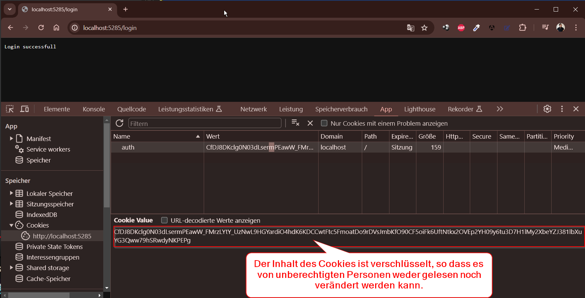

## basic2.Authentication
Senzibel Daten verschlüsseln

zur vergleich im ersten Projekt basic1.Authentication\Program.cs werden die Authentifizierungsinformationen (in diesem Fall ein Benutzername) direkt in einem Cookie gespeichert. 
Dies kann ein Sicherheitsrisiko darstellen, da Cookies leicht von einem Angreifer gelesen werden können, der Zugriff auf den Computer des Benutzers hat.

Aber in Projekt Basic2.Authentication\Program.cs wird dieses Problem durch die Verwendung der Data Protection API von ASP.NET Core gelöst. 
Diese API bietet eine einfache Möglichkeit, sensible Daten zu verschlüsseln und zu entschlüsseln.


Hier ist, was im Detail verbessert wurde:
1.	DataProtection hinzugefügt: Mit ``builder.Services.AddDataProtection();`` wird die Data Protection API zu den Diensten hinzugefügt.		
```csharp
builder.Services.AddDataProtection();
```

2.	Verschlüsselung der Authentifizierungsinformationen: Beim Login wird ein "Protector" erstellt, der verwendet wird, um die Authentifizierungsinformationen zu verschlüsseln, bevor sie im Cookie gespeichert werden.
```csharp
var protector = dataProtection.CreateProtector("auth-cookie");
var protectedPayload = protector.Protect("Username:Musteruser");
ctx.Response.Headers.SetCookie = $"auth={protectedPayload}";
```

3.	Entschlüsselung der Authentifizierungsinformationen: Beim Abrufen des Benutzers wird der gleiche "Protector" verwendet, um die verschlüsselten Authentifizierungsinformationen zu entschlüsseln.

```csharp
var protector = dataProtection.CreateProtector("auth-cookie");
var protectedPayload = authCookie.Split('=').Last();
var payload = protector.Unprotect(protectedPayload);
```




Diese Verbesserungen erhöhen die Sicherheit der Anwendung, indem sie verhindern, dass sensible Authentifizierungsinformationen im Klartext gespeichert werden.