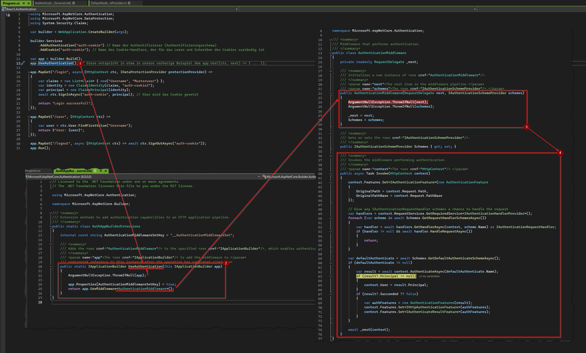
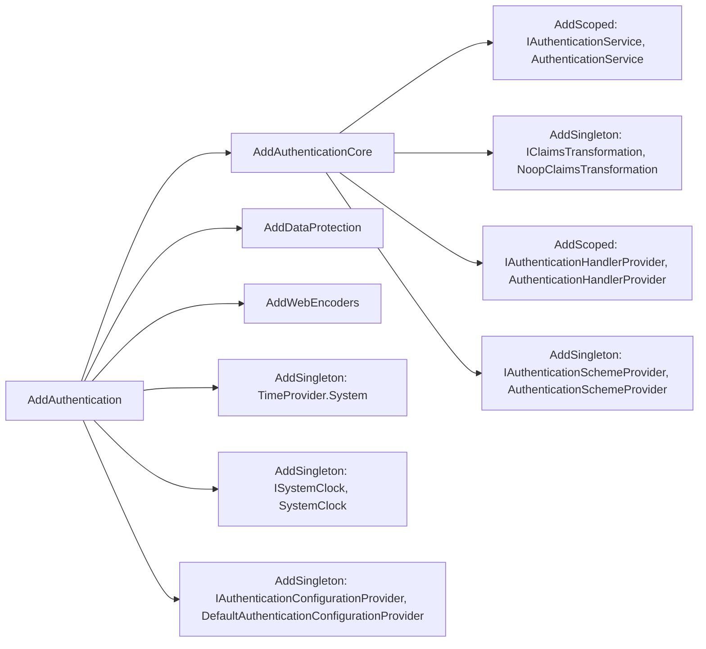

## Basic5.Authentication 

Das Projekt ``Basic4.Authentication\Program.cs`` implementiert eine manuelle Authentifizierung. 
Es verwendet die IDataProtectionProvider-Schnittstelle, um ein Cookie zu schützen, das die Benutzerinformationen enthält. 
Dieser Ansatz erfordert mehr Code und ist fehleranfälliger, da Sie die Authentifizierungslogik selbst verwalten müssen. 
Es besteht auch das Risiko, dass Sicherheitslücken übersehen werden, da die Implementierung nicht auf Best Practices basiert.


Projekt ``Basic5.Authentication\Program.cs`` verwendet dagegen die eingebaute Authentifizierungsfunktionalität von ASP.NET Core. 
Es verwendet die Methoden AddAuthentication und AddCookie, um ein Authentifizierungsschema zu konfigurieren und Cookies zu verwalten. 
Dieser Ansatz ist einfacher, sicherer und weniger fehleranfällig, da er auf Best Practices und eingebauten Funktionen basiert.

Projekt ``Basic5..`` ist besser, da es die eingebauten Authentifizierungsfunktionen von ASP.NET Core nutzt, was zu sichererem und einfacherem Code führt. 
Es ist immer besser, eingebaute Sicherheitsfunktionen zu verwenden, wenn sie verfügbar sind, als sie selbst zu implementieren.

### UseAuthentication Middleware

Die von ASP.NET bereitgestellte ``AuthenticationMiddleware`` Middleware hat einige Ähnlichkeiten mit unserer selbstgebauten Middleware aus dem Projekt Basic4.




In der Abbildung ist zu sehen, dass die Middleware ``UseAuthentication`` die Klassen ``AuthenticationMiddleware`` (2) und (3) verwendet, um bei jeder Anfrage automatisch die Authentifizierung durchzuführen.
Dabei wird ``IAuthenticationSchemeProvider`` (3) verwendet. Diese Schnittstelle hat die Aufgabe, Authentifizierungsschemata bereitzustellen.

**Achtugn:** Ein Authentifizierungsschema definiert, wie ein Benutzer authentifiziert wird, z. B. durch die Verwendung von Cookies, JWT-Token oder anderen Mechanismen.

In unserem Fall verwenden wir das Schema ``auth-cookie``. Dieses Schema wird durch die Methode ``AddCookie`` konfiguriert.


## Services konfigurieren

Hier werden die notwendigen Dienste konfiguriert, die von der Middleware benötigt werden, um die Authentifizierung durchzuführen.


```csharp
builder.Services
    .AddAuthentication("auth-cookie")
    .AddCookie("auth-cookie");
```

In diesem Diagramm können wir einen kleinen Ausschnitt der Registrierung der verschiedenen Dienste sehen, z.B. AddDataProtection, das wir in Projekt Basic-3 verwendet haben, um die Cookies zu verschlüsseln.

